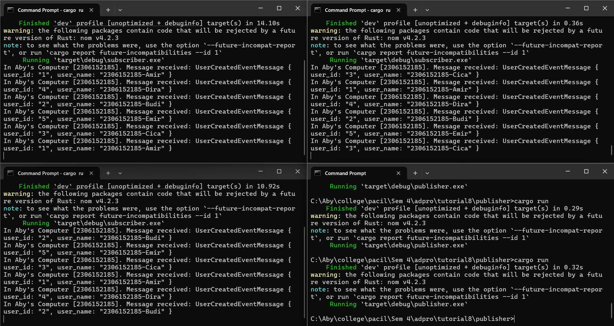
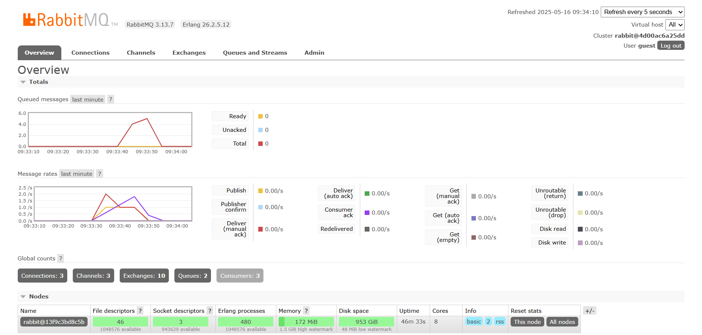

# Tutorial 9 Adpro 
**Emanuella Abygail - 2306152185**

## What is amqp?
AMQP (Advanced Message Queuing Protocol) adalah protokol komunikasi jaringan terbuka yang dirancang untuk mengirimkan pesan antar aplikasi, komponen, atau sistem yang berbeda secara asinkron. Protokol ini digunakan dalam message-oriented middleware yang memungkinkan berbagai jenis komunikasi seperti message queuing, publish-subscribe, dan request-response. AMQP mendefinisikan message structure, exchange rules, dan operasi-operasi yang dapat dilakukan pada pesan.

Pada tutorial ini, AMQP digunakan untuk membuat sistem message queue yang memungkinkan aplikasi menerima dan memproses pesan secara asinkron. Penggunaan AMQP terlihat pada pendefinisian pesan pada `UserCreatedEventMessage`, pembuatan handler untuk menerima pesan (`impl MessageHandler<UserCreatedEventMessage> for UserCreatedHandler`), inisialisasi listener AMQP pada `let listener`, menunggu pesan pada `_ = listener.listen(...)`, dan infinite looping (`loop {}`)

## What does it mean? guest:guest@localhost:5672 , what is the first guest, and what is the second guest, and what is localhost:5672 is for?
`guest` pertama pada `guest:guest` adalah username, sedangkan yang kedua adalah password. `localhost` adalah alamat host dari AMQP broker (server RabbitMQ). `:5672` adalah port di mana AMQP broker sedang listening. `guest:guest@localhost:5672` secara keseluruhan adalah URL yang menyambungkan ke server AMQP.

## Simulation Slow Subscriber

Gambar di atas adalah message broker ketika diberi delay 2 detik untuk setiap proses. Karena untuk suatu proses dijalankan harus menunggu proses sebelumnya selesai, terdapat banyak queue atau antrian. Banyak message yang dikirimkan oleh publisher yang tidak dapat secara langsung diproses oleh subscriber yang menerika pesan-pesan tersebut. Saya menjalankan `cargo run` pada publisher sebanyak 4 kali dan terdapat 18 message pada queue.

## Three Subscribers

Ketika 3 subscriber dijalankan bersama-sama, proses akan terbagi di antara ketiga subscriber tersebut. Hal ini dapat terlihat pada gambar kedua di mana terlihat bahwa terdapat 3 grafik line berbeda pada message rate (satu untuk masing-masing subscriber) dan queue nya pun jauh lebih sedikit daripada jika hanya 1 subscriber yang dijalankan padahal publisher dijalankan lebih banyak daripada sebelumnya. Dengan begitu, kita bisa mendapatkan hasil yang berbeda hanya dengan mengubah konfigurasi message broker atau jumlah subscriber yang menerima message tanpa mengubah kode. Ini adalah event driven. 